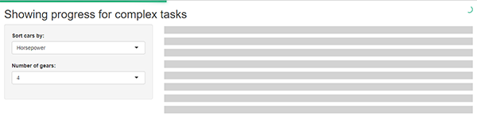

# loading and progress
When apps have some longer calculations it is good practice to show the user an indication that the app is still up and running. This app shows an implementation of a minimalistic progress bar using NProgress and how to use 'skeleton screens' with Shiny. In this example grey boxes (that's the 'skeleton') are displayed till the data table is fully loaded to provide a nicer user experience, as used by Facebook, YouTube etc.

See it in action [here](https://shiny.epi-interactive.com/loading)

