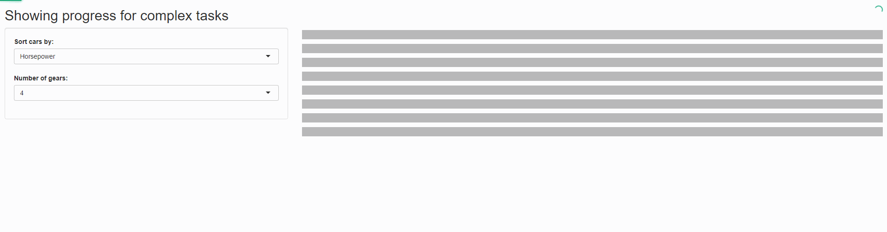

# Loading and Progress Indicators
When apps have some longer calculations it is good practice to show the user an indication that the app is still up and running. This app shows an implementation of a minimalistic progress bar using NProgress and how to use 'skeleton screens' with Shiny. In this example grey boxes (that's the 'skeleton') are displayed till the data table is fully loaded to provide a nicer user experience, as used by Facebook, YouTube etc.

See it in action [here](https://shiny.epi-interactive.com/loading)




## Focus
This feature focuses on improving the UX of applications by showing progress and activity to the user. We found that this can be especially useful for our Shiny apps where we need to perform calculations and process data on the fly.

## How it works
Using [NProgress](https:/http://ricostacruz.com/nprogress/) we listen for some built in Shiny lifecycle events.

```js
// Start NProgress when starting calculations
$(document).on('shiny:busy', function(event) {
    NProgress.start({
      showSpinner: false,
    });
});

// End NProgress when shiny goes idle 
$(document).on('shiny:idle', function(event) {
    NProgress.done();
});

```

Create a skeleton placeholder for your content to show while its loading
``` r
createTableSkeleton <- function() {
       div(class="skeleton",
          div(class="sk-layout sk-layout-column",
              div(class="sk-text-row skeleton-item")
          )
       )
}
```
Add it to your Shiny app
``` r
mainPanel(
   tableOutput("table"),
   createTableSkeleton()
)

```
Use `:empty` CSS pseudo to only show the skeleton when your content is loading
``` css
.skeleton {
  display: none;
}

.shiny-bound-output:empty + .skeleton {
  display: block;
}
```


---

Code created by [Epi-interactive](https://www.epi-interactive.com) 

As always, our expert team is here to help if you want custom training, would like to take your dashboards to the next level or just need an urgent fix to keep things running. Just get in touch for a chat.

[https://www.epi-interactive.com/contact](https://www.epi-interactive.com/contact)
